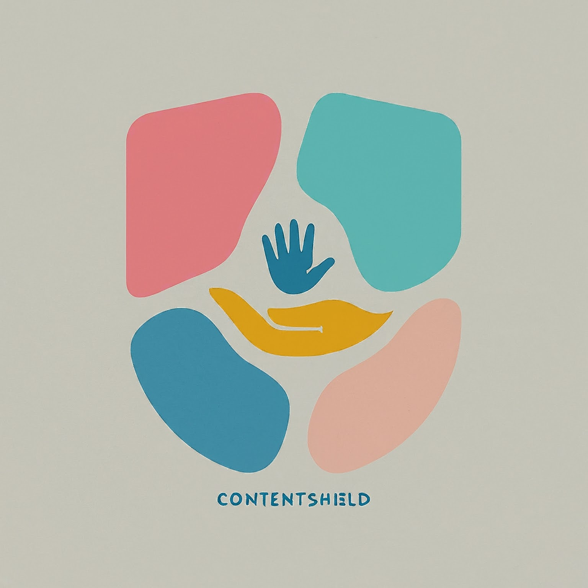

  

<h1 align="center">ContentShield 🛡️</h1>

  <em>ContentShield 🛡️ is an unified AI-based tool for harmful content detection.</em>

---

  
Table of Contents

- [📍 Overview](#-overview)
- [🧩 Features](#-features)
- [🚀 Usage](#-usage)
- [👾 Gallery](#-gallery)
- [📐 Project Structure](#-project-structure)
- [🧑‍💻 Contact](#-contact)

## 📍 Overview

ContentShield 🛡️ is an innovative project that empowers social media platforms with a suite of lightweight AI engines. Our mission is to detect and mitigate harmful content, creating a safer online environment. With a wide range of AI tools, we offer a comprehensive solution to combat various forms of harmful content, ensuring a positive and secure user experience. 

Let's make a world a better place! 

## 🧩 Features

- [ ] Text-based harm detection (sexism, racism, body shaming, etc.).
- [ ] Harmful object detection in images.
- [ ] Harmful content mitigation (text and image).

## 🚀 Usage

1. Setup environment

2. Running the project
 

## 👾 Gallery

## 📐 Project Structure

## 🧑‍💻 Contact

+ **Gmail**: minh.leduc.0210@gmail.com
+ **LinkedIn**: https://www.linkedin.com/in/minhle007
+ **Medium**: https://medium.com/@minhle_0210